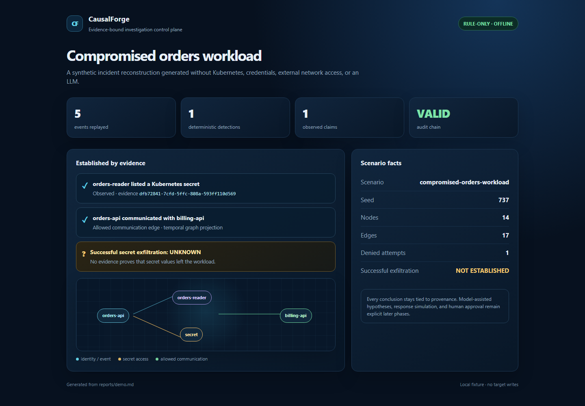
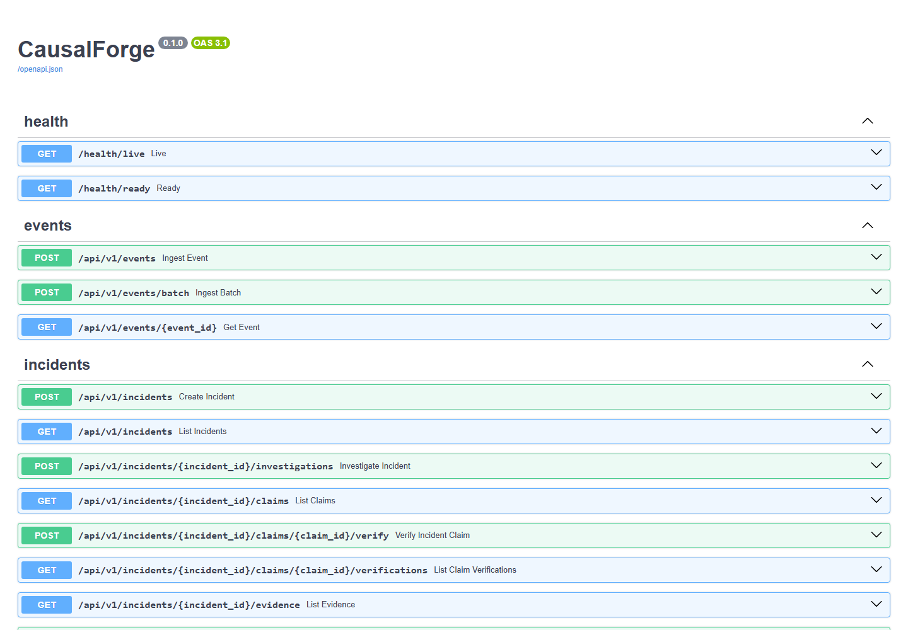

# CausalForge

**Evidence-bound incident reconstruction and reversible response for cloud-native systems.**

CausalForge is an open-source security investigation control plane for turning Kubernetes and
cloud-native telemetry into provenance-tracked claims, temporal attack graphs, competing
hypotheses, blast-radius analysis, and human-approved reversible response plans.

It is intentionally **not** a SIEM, EDR, vulnerability scanner, generic SOC chatbot, or
autonomous penetration-testing agent. AI may propose hypotheses and plans, but deterministic
verification and policy controls decide what can be called verified or executed.

## Current checkpoint

The repository is at **Phase 4 — deterministic investigation API**. It contains the versioned domain
schemas, state-transition contract, FastAPI/infrastructure shell, strict canonical event ingestion,
redaction and deduplication, an evidence ledger, a hash-chained audit log, temporal graph and RBAC
reachability utilities, a scoped Sigma subset, bounded event correlation, and a rule-only case
engine, provider-neutral structured-output boundary, deterministic rule-only fallback,
prompt-injection-safe context builder, tenant-scoped local knowledge retrieval, and a local
principal-verified investigation API. It also includes a deterministic, offline compromised
`orders-api` fixture and generated evidence-bound report. The durable agent workflow, UI, bounded
hypothesis verifier, typed evidence planner, and fixture-only attested collector are present;
durable coordination, UI, and response execution remain later phases. Claims can also be
deterministically promoted to `verified`, or remain `unknown`/`disputed`, through explicit evidence
gates.

## Design invariants

- Evidence is untrusted data, never instructions.
- Missing telemetry is reported as unknown unless coverage proves completeness.
- LLM output cannot mark claims verified, select arbitrary tools, or execute writes.
- Read-only collection is separated from write-capable response execution.
- High-impact actions require a valid, scoped, unexpired human approval.
- Fixture mode must remain deterministic and require no LLM or external network.
- Every important conclusion cites evidence IDs and exposes contradictions and unknowns.

## Offline demo

Replay the synthetic workload without an LLM, Kubernetes, Docker, credentials, or external network:

```text
uv run --extra dev python scripts/demo.py --output reports/demo.md
```

The report shows secret enumeration, allowed and denied communication, a valid audit chain, and
successful secret exfiltration explicitly marked **UNKNOWN / NOT ESTABLISHED**. Response simulation
and human approval are intentionally not part of this offline fixture yet.

## Project snapshots

The current checkpoint is API-first rather than a browser analyst UI. These are real local project
captures: the FastAPI OpenAPI surface and the deterministic offline investigation result.

<p align="center">
  
</p>

<p align="center">
  
</p>

See [docs/screenshots/](docs/screenshots/) for the source note and offline snapshot HTML.

## Development status

See [docs/implementation-state.md](docs/implementation-state.md) for the current checkpoint and
[docs/implementation-plan.md](docs/implementation-plan.md) for the phased delivery plan.

## Local quickstart

```text
uv sync --extra dev
uv run --extra dev python -m pytest
uv run --extra dev python -m ruff check backend
uv run --extra dev python -m mypy backend/causalforge
uv run --extra dev python -m uvicorn causalforge.main:app --app-dir backend
```

Then open `http://127.0.0.1:8000/docs` or check:

```text
GET /health/live
GET /health/ready
```

See [docs/api.md](docs/api.md) for the local principal headers and deterministic replay flow.

The default local profile uses SQLite and requires the explicit migration command below; automatic
schema creation is available only for isolated tests. For the optional local PostgreSQL and Redis
services, copy `.env.example` to `.env`, review the values, run `docker compose up -d`, then apply
`python -m alembic -c backend/alembic.ini upgrade head` (or the equivalent `uv run` command). The API reports `503 Not Ready` until the
configured database has the current migration revision.

The deterministic engine is exercised by the fixture integration tests and does not require an LLM,
Kubernetes, PostgreSQL, Redis, or external network access.

## Safety and scope

The default project scope is local fixtures and an optional local `kind` cluster. Do not connect
the demo to systems that are not explicitly authorized. Production-like response execution is
disabled by default and will remain behind explicit policy and approval gates.

## License

Apache-2.0. The license file and contributor/security policies will be added with the project
packaging phase.
