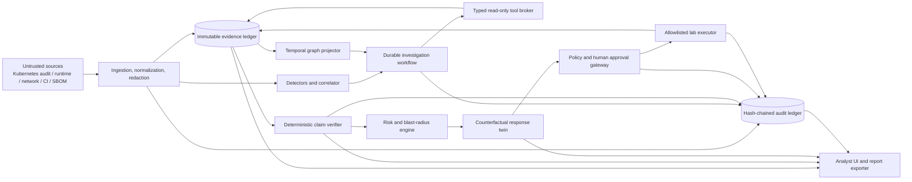

# CausalForge architecture

## Mission

CausalForge is an evidence-bound investigation control plane. It converts untrusted or
semi-trusted cloud-native signals into claims whose provenance, temporal consistency, source
independence, and coverage can be inspected. It then simulates and gates reversible response.

## Trust-boundary view



The boundary between the typed broker and connectors is deliberately narrow. Evidence and
retrieved documents cross into model context as labeled data, never as executable instructions.
The only path toward a write is `plan -> simulation -> policy -> human approval -> allowlisted
executor -> postcondition verification`.

## Deterministic versus model-assisted work

| Responsibility | Deterministic service | Model assistance allowed |
|---|---:|---:|
| Parse, normalize, redact, hash | yes | no |
| Deduplicate and correlate events | yes | no |
| RBAC/reachability and temporal checks | yes | no |
| Generate competing hypotheses | no | yes, structured output |
| Choose from registered evidence queries | bounded planner | candidate ranking only |
| Promote a claim to `verified` | yes | no |
| Calculate blast radius | yes | no |
| Draft response alternatives | bounded schemas | yes |
| Approve or execute response | policy + human | no |
| Explain verified facts | grounded composer | yes, citations required |

## State machine

```text
NEW -> TRIAGED -> INVESTIGATING -> EVIDENCE_COLLECTED
  -> VERIFIED -> RESPONSE_PLANNED -> SIMULATED -> AWAITING_APPROVAL
  -> EXECUTING -> VALIDATING -> CLOSED
```

Alternative outcomes are `REJECTED`, `DISPUTED`, `INSUFFICIENT_EVIDENCE`, `ROLLED_BACK`, and
`FAILED_RECONCILIATION`. A transition is valid only when its required artifact set exists, policy
allows the transition, and the audit entry has been persisted. The transition contract is tested
in `backend/tests/unit/test_state_machine.py`.

## Investigation loop

1. A detector or analyst creates a case from normalized evidence.
2. The coordinator records competing hypotheses and explicit falsifiers.
3. The planner scores only registered read-only queries by information gain, cost, privacy, and
   operational risk.
4. Connectors return immutable, redacted evidence with source coverage and hashes.
5. The graph analyst derives paths and relationships; it does not invent missing edges.
6. The verifier binds claims to evidence and either promotes, disputes, rejects, or leaves them
   unknown.
7. The risk engine calculates reachable assets and exposes score components.
8. Candidate responses are simulated against a versioned dependency/security snapshot.
9. A human reviews exact scope, evidence, impact, rollback, and expiration before approval.
10. The lab executor applies only the approved allowlisted action and postconditions are checked.

## Failure containment

Investigations have deadlines, token/tool budgets, circuit breakers, and explicit incomplete states.
Read retries must be idempotent; write retries are never automatic. State drift, missing rollback
metadata, policy ambiguity, failed verification, or incomplete coverage prevents unsafe promotion.
